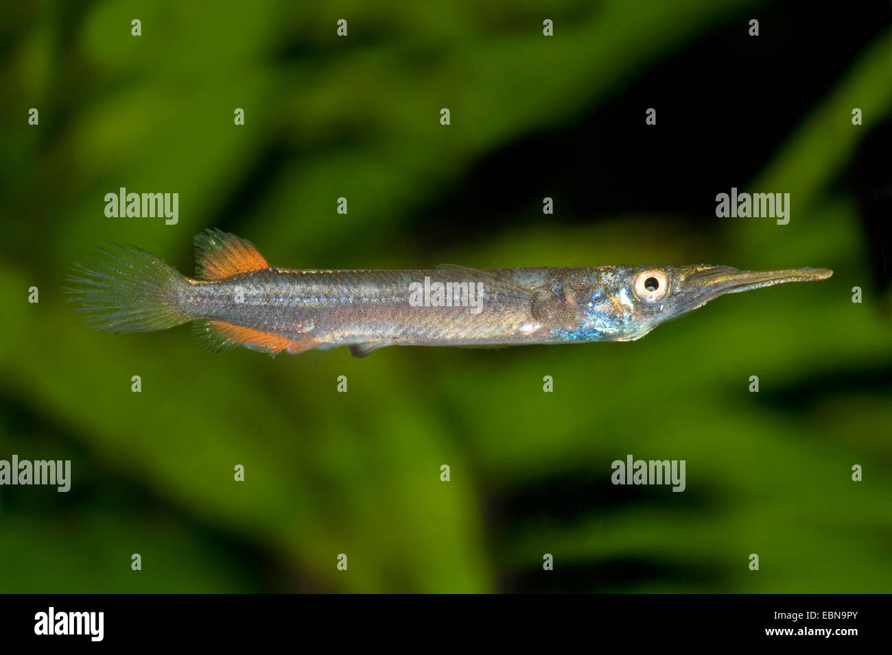

# Состав рыб для аквариума (270 литров, 90х50х60 см)

## Итоговый зафиксированный состав

### 1. Верхний ярус (у кромки воды)

#### Дермогенис (Dermogenys pusillus)

- **Русское название:** Дермогенис, полурыл обыкновенный
- **Латинское название:** Dermogenys pusillus
- **Тайское название:** ปลากัดปากแหว่ง (pla kad paak waeng)
- **Количество:** 7 шт.
- **Описание:** Необычные «полурылы» с характерным строением рта. Держатся у поверхности воды.
- **Особенности:** Мирные, стайные, интересное поведение при кормлении.

#### Гуппи (Poecilia reticulata)

- **Русское название:** Гуппи
- **Латинское название:** Poecilia reticulata
- **Тайское название:** ปลากัดฝรั่ง (pla kat farang)
- **Количество:** 10–15 шт.
- **Описание:** Динамика и яркость в верхнем слое воды.
- **Особенности:** Живородящие, неприхотливые, красивые хвосты у самцов.

### 2. Основная толща (средний и верхне-средний слои)

#### Конго-тетра (Phenacogrammus interruptus)

- **Русское название:** Конго-тетра
- **Латинское название:** Phenacogrammus interruptus
- **Тайское название:** ปลาคองโกเทตร้า (pla kongo tetra)
- **Количество:** 10–12 шт.
- **Описание:** Роскошная переливающаяся стая с неоновыми отблесками.
- **Особенности:** Мирные, стайные, очень эффектные при движении.

#### Скалярия (Pterophyllum scalare)

- **Русское название:** Скалярия
- **Латинское название:** Pterophyllum scalare
- **Тайское название:** ปลาสการ์เลท (pla scarlet)
- **Количество:** 4–6 шт.
- **Описание:** Вертикальный акцент, дисковидная форма тела.
- **Особенности:** Грациозные, требуют спокойной обстановки.

#### Жемчужные гурами (Trichopodus leerii)

- **Русское название:** Жемчужный гурами
- **Латинское название:** Trichopodus leerii
- **Тайское название:** ปลากุรามิเพิร์ล (pla gurami pearl)
- **Количество:** 4–6 шт.
- **Описание:** Спокойные и грациозные с жемчужным отливом.
- **Особенности:** Лабиринтовые рыбы, могут дышать атмосферным воздухом.

#### Меченосцы (Xiphophorus hellerii)

- **Русское название:** Меченосец
- **Латинское название:** Xiphophorus hellerii
- **Тайское название:** ปลาดาบสั้น (pla dap san)
- **Количество:** 5–7 шт.
- **Описание:** Яркие пятна в толще воды с характерным «мечом» у самцов.
- **Особенности:** Живородящие, активные, могут быть территориальными.

### 3. Придонный ярус (над грунтом)

#### Апистограмма Рамирези (Apistogramma ramirezi)

- **Русское название:** Апистограмма Рамирези
- **Латинское название:** Apistogramma ramirezi
- **Тайское название:** ปลาอาพิสโตแกรมม่ารามิเรซี (pla apistogramma ramirezi)
- **Количество:** 1 пара
- **Описание:** Маленькие яркие цихлиды с мирным нравом.
- **Особенности:** Требуют мягкой воды, образуют пары, заботятся о потомстве.

#### Апистограмма Какаду (Apistogramma cacatuoides)

- **Русское название:** Апистограмма Какаду
- **Латинское название:** Apistogramma cacatuoides
- **Тайское название:** ปลาอาพิสโตแกรมม่าคาคาทู (pla apistogramma cockatoo)
- **Количество:** 1 пара
- **Описание:** Яркие цихлиды с характерными плавниками.
- **Особенности:** Более территориальные, чем Рамирези, требуют укрытий.

#### Пельвикахромис пульхер (Pelvicachromis pulcher)

- **Русское название:** Пельвикахромис пульхер, Попугайчик
- **Латинское название:** Pelvicachromis pulcher
- **Тайское название:** ปลาพอปปี้ (pla poppy)
- **Количество:** 1 пара
- **Описание:** Красивые африканские цихлиды.
- **Особенности:** Мирные, образуют стабильные пары, интересное поведение.

#### Коридорасы (2 вида по 5 штук каждый)

##### Зеленый коридорас (Corydoras aeneus)

- **Русское название:** Зеленый коридорас, бронзовый коридорас
- **Латинское название:** Corydoras aeneus
- **Тайское название:** ปลาคอรีดอรัสเขียว (pla corydoras khiew)
- **Количество:** 5 шт.
- **Описание:** Классические коридорасы с красивым зеленовато-бронзовым отливом.
- **Особенности:** Очень выносливые, активные, отличные санитары аквариума.

##### Коридорас Джули (Corydoras julii)

- **Русское название:** Коридорас Джули, леопардовый коридорас
- **Латинское название:** Corydoras julii
- **Тайское название:** ปลาคอรีดอรัสจูลี่ (pla corydoras julii)
- **Количество:** 5 шт.
- **Описание:** Элегантные коридорасы с характерным леопардовым рисунком.
- **Особенности:** Более редкий вид, требуют качественной воды, очень мирные.

**Общие особенности коридорасов:**

- Стайные донные рыбы, постоянно перерывают грунт в поисках корма
- Отличные санитары аквариума
- Мирные и уживчивые с другими видами
- Требуют чистой воды с высоким содержанием кислорода

### 4. Донный ярус и «санитары» растений

#### Зебра Плеко (Hypancistrus zebra)

- **Русское название:** Зебра Плеко, зебровый сомик
- **Латинское название:** Hypancistrus zebra
- **Тайское название:** ปลาเซบร้าเพลโค (pla zebra pleco)
- **Количество:** 1 шт.
- **Описание:** Настоящая жемчужина коллекции. Очень редкий и красивый сом с четкими черно-белыми полосами.
- **Особенности:** Ведет скрытный образ жизни, требует наличия узкой щели-укрытия. Любит чистую, богатую кислородом воду и стабильную температуру (около 26–28°C).

#### Отоцинклюс (Otocinclus affinis)

- **Русское название:** Отоцинклюс
- **Латинское название:** Otocinclus affinis
- **Тайское название:** ปลาโอโตซินคลัส (pla otocinclus)
- **Количество:** 10–12 шт.
- **Описание:** Маленькие, мирные сомики, которые идеально чистят листья растений от водорослевого налета.
- **Особенности:** Очень чувствительны к качеству воды и наличию аммиака/нитритов. Строгие вегетарианцы.

#### Акантофтальмус Кюля (Acanthophthalmus kuhlii)

- **Русское название:** Акантофтальмус Кюля, вьюн Кюля
- **Латинское название:** Acanthophthalmus kuhlii
- **Тайское название:** ปลาหนอนคูห์ลี (pla non kuhli)
- **Количество:** 7 шт.
- **Описание:** Вьюновые змейки с характерной полосатой окраской.
- **Особенности:** Ночные, ведут скрытный образ жизни, любят зарываться в грунт.

## Важные замечания по содержанию

### Зебра Плеко (L046)

- Очень ценится и редок
- Требует чистой, богатой кислородом воду
- Стабильная температура: 26–28°C
- Обязательно наличие индивидуального укрытия (трубка или узкий грот)
- Не должен беспокоиться другими донными рыбами

### Отоцинклюсы

- Очень чувствительны к качеству воды
- Лучше подселять в уже стабильный, «созревший» аквариум
- Требуют живые растения
- Строгие вегетарианцы

### Кормление донных рыб

- **Зебра Плеко:** плотоядный сом (любит качественные таблетки с белком)
- **Отоцинклюсы:** строгие вегетарианцы (растительные таблетки, спирулина)
- **Коридорасы:** всеядные (живой, замороженный, сухой корм)
- **Акантофтальмусы:** всеядные, предпочитают живой корм

### Зонирование аквариума

С тремя парами цихлид и Зеброй Плеко дно должно быть богато на укрытия:

- Коряги
- Камни
- Пещеры
- Узкие щели для Зебра Плеко

Каждая пара должна иметь свой «угол» для снижения территориальных конфликтов.

## Резюме

Аквариум сочетает в себе:

- **Визуальную мощь:** скалярии, конго-тетра
- **Интересное поведение:** 3 вида цихлид
- **Редкую экзотику:** Зебра Плеко

Состав выглядит завершенным и очень престижным. Общее количество рыб: около 65-70 особей, что оптимально для аквариума 270 литров.

---

## Биологические требования к рыбам

### Температурный режим

- **Тропические виды**: 24-28°C
- **Субтропические виды**: 20-26°C
- **Термоустойчивые виды**: 22-30°C (для условий Таиланда)

### Параметры воды для Таиланда

- **Жесткость**: 2-15°dGH (мягкая вода)
- **pH**: 6.5-7.5 (слабокислая до нейтральной)
- **Аммиак/Нитриты**: 0 ppm
- **Нитраты**: <40 ppm

#### Размеры рыб для аквариума 900x500x600mm

- **Мелкие виды**: до 5 см (стайные по 10-15 штук)
- **Средние виды**: 5-10 см (группы по 5-8 штук)
- **Крупные виды**: 10-15 см (по 1-3 особи)

### Биологические требования к мирным рыбам

#### Температурный режим для условий Таиланда

- **Оптимальные виды**: 24-28°C (термоустойчивые тропические рыбы)
- **Допустимый диапазон**: 22-30°C (с учетом климатических особенностей Паттаи)
- **Критические значения**: ниже 20°C и выше 32°C недопустимы

#### Параметры воды для Таиланда

- **Жесткость**: 2-15°dGH (естественная мягкая вода региона)
- **pH**: 6.5-7.5 (слабокислая до нейтральной, оптимально для большинства тропических видов)
- **Аммиак/Нитриты**: 0 ppm (критически важно для мирных рыб)
- **Нитраты**: <20 ppm (мирные рыбы чувствительны к высоким концентрациям)

#### Размеры рыб для аквариума 900x500x600mm (270 литров)

- **Мелкие виды**: 2-5 см (стайные по 8-15 штук)
- **Средние виды**: 5-8 см (группы по 4-6 штук)
- **Крупные мирные виды**: 8-12 см (по 1-2 особи, учитывая объем)

### Экологические зоны в аквариуме с учетом ориентации на юг

#### Зона интенсивного освещения (южная сторона, лицевое стекло)

- **Особенности**: Прямое солнечное освещение, повышенная температур
- **Подходящие мирные виды**: Светолюбивые данио, некоторые расборы
- **Растения**: Быстрорастущие светолюбивые виды для затенения
- **Меры защиты**: Частичная затененность в пиковые часы для предотвращения перегрева

#### Зона умеренного освещения (центральная часть)

- **Особенности**: Рассеянный свет, оптимальная температур
- **Подходящие мирные виды**: Большинство тропических рыб (неоны, тетры, кардиналы)
- **Растения**: Среднетребовательные к свету виды
- **Преимущества**: Стабильные условия для большинства видов

#### Зона затенения (северная сторона, заднее стекло)

- **Особенности**: Минимальное прямое солнце, более прохладная температур
- **Подходящие мирные виды**: Теневыносливые виды (многие сомики, вьюновые)
- **Растения**: Теневыносливые виды (анубиасы, криптокорины)
- **Преимущества**: Укрытия для рыб, отдых от яркого света

### Адаптация мирных рыб к условиям Таиланда

#### Преимущества местных видов

- **Естественная адаптация**: Развитые механизмы терморегуляции
- **Иммунитет**: Устойчивость к местным патогенам
- **Доступность**: Легко найти в аквариумных магазинах Паттаи

#### Сезонные considerations для мирных рыб

- **Сезон дождей (май-октябрь)**:

  - Пониженная температур воды
  - Усиление фильтрации из-за повышенной мутности
  - Контроль параметров воды

- **Сухой сезон (ноябрь-апрель)**:
  - Высокая температур, риск перегрева
  - Интенсивное солнечное освещение
  - Усиление аэрации и создание укрытий

#### Специфика открытого балкона в Паттае

- **Вентиляция**: Естественная аэрация за счет ветров
- **Температурные колебания**: Разница между днем и ночью
- **Влажность**: Высокая влажность воздуха благоприятна для тропических видов
- **Защита**: Необходимость укрытий от прямого солнца и хищников

### Особенности поведения мирных рыб

#### Стайные мирные рыбы

- **Характеристики**: Предпочитают жить в группах, снижают стресс друг у друга
- **Минимальное количество**: 6-10 особей для комфортного существования
- **Требования к пространству**: Открытые участки для координированного плавания
- **Преимущества**: Создают живую динамику в аквариуме, хорошо демонстрируют естественное поведение

#### Пары и небольшие группы

- **Характеристики**: Некоторые виды образуют стабильные пары или небольшие группы
- **Требования**: Достаточное пространство для каждой пары/группы
- **Преимущества**: Интересное поведение размножения, ухаживание

#### Одиночные мирные виды

- **Характеристики**: Крупные рыбы, которые комфортно себя чувствуют в одиночку
- **Требования**: Большое пространство, минимальная конкуренция за корм
- **Совместимость**: Хорошо уживаются с мелкими стайными рыбами при правильном подборе

### Пищевые требования мирных рыб

#### Поверхностные корма

- **Типы**: Плавающие гранулы, хлопья, замороженные корма
- **Виды**: Данио, расборы, гуппи
- **Частота**: 2-3 раза в день небольшими порциями

#### Корма для толщи воды

- **Типы**: Медленно тонущие гранулы, микро-корма
- **Виды**: Неоны, тетры, кардиналы
- **Особенности**: Корм должен оставаться в толще воды достаточно долго

#### Донные корма

- **Типы**: Тонущие таблетки, гранулы, замороженные корма
- **Виды**: Сомики, вьюновые, водорослееды
- **Важно**: Обеспечить доступ к корму для всех донных обитателей
